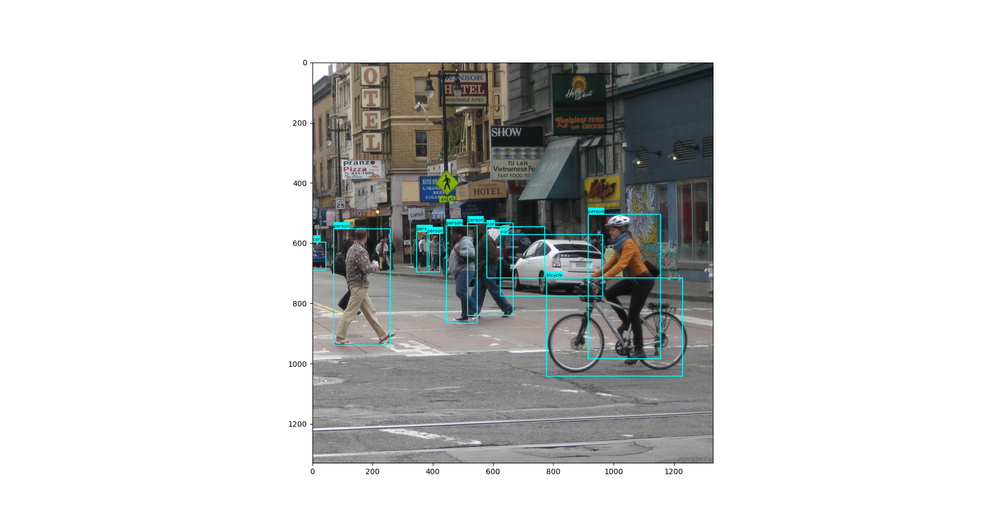
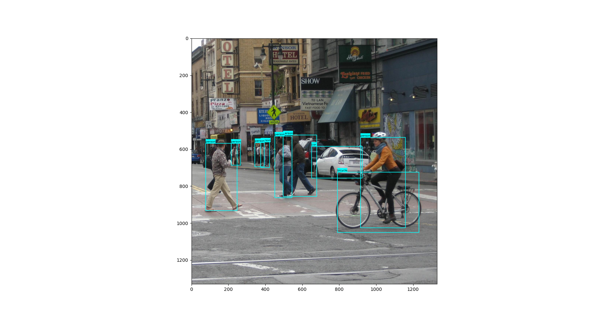

## 支持单机多卡的ddp训练模式

## 可供选择的模型有 yolo v3 v4 v5 (再我完成后，发现又出现了yolo v7) 哎。。。。

## 参考了一些大佬的代码 (偷懒就不贴出来了)

## 支持 early-stop 封装了一些预处理算子 支持多种损失函数 支持 onnx 推理加速

## 使用封装的接口 最后会自动生成 onnx 的数据

## 封装了接口 可插拔 自行修改即可

## 训练数据用的是 voc 格式 (resource/all_voc_*.txt) 照着例子 生成此种类型的数据 就可以训练了

## 训练代码

CUDA_VISIBLE_DEVICES=0,1 python -m torch.distributed.launch --nproc_per_node=2 train.py > yolo_v5.log &

## 当然也可以单卡训练 直接运行 train.py 即可 (将parallel设置为false)

## 实际效果比较 yolo v5 最好

## yolo v5

## yolo v4

## yolo v3

## 测试结果

## yolo v3 voc 训练模型文件

链接：https://pan.baidu.com/s/1W7tjHIhfuxFR-xY9UH0Q9w
提取码：8888

## yolo v4 voc 训练模型文件

链接：https://pan.baidu.com/s/1wKwB6ALk5-7rbC_Usqq88A
提取码：8888

## yolo v5 voc 训练模型文件

链接：https://pan.baidu.com/s/1EdIbV4wSs01HAz6GYrTcHQ
提取码：8888

## 预训练模型 (重新训练的时候 会用到)

链接：https://pan.baidu.com/s/1w70NuuDGrh3PHofImKr1vA
提取码：8888

