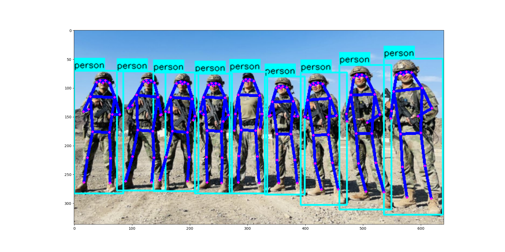

## 模型权重、数据集
预训练权重已经训练好的模型文件等可以通过网盘下载
链接: https://pan.baidu.com/s/1a65cgfZ0FHX6RUw4yEJnng?pwd=1234 提取码: 1234
## C++ 推理
参考: https://github.com/zhangluoyang/luoyang ，实现 c++ onnxruntime 推理
## 样本格式
参考 resource目录下面的文件格式
其中 *_voc_*.txt 是 voc数据集，用于目标检测
    *_person_*.txt 是 coco数据集，用于人体关键点检测
    *_wild_*.txt 是 wider_face数据集，用于人脸检测

## 训练脚本 (train目录)
参考 train目录下面的文件
## 测试脚本 (example目录)
参考 example目录下面的文件
## 模型列表
|model| detect | face | pose|
| :----: | :----: | :----: | :----: | 
| yolov3 | done  | - | -|
| yolov4 | done  | - | -|
| yolov5 | done  | done | done|
| yolov6 | done  | done | done|
| yolov7 | done  | done | done|
| yolov8 | done  | - | -|
## 效果
|model| detect | face | pose|
| :----: | :----: | :----: | :----: | 
| yolov3 |  | - | -|
| yolov4 |  | - | -|
| yolov5 |  | ||
| yolov6 |  | ||
| yolov7 |  | ||
| yolov8 |  | - | -|
## 

